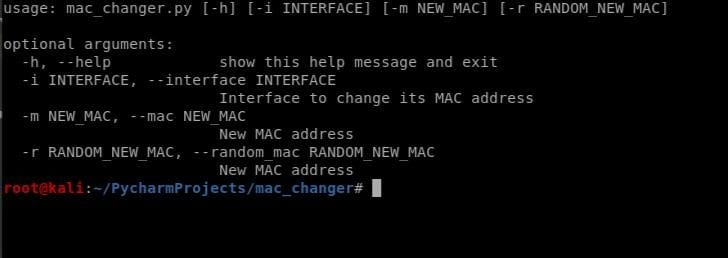

# Mac-Changer

# What IS MAC CHANGER ?

==> This tool allows us to change our MAC address.  
==> It has two different uses. Our first option is to manually change the MAC address.  
==> The second option randomly assigns the MAC address.

# USAGE

<ul>
  <li>
    python3 mac_changer -i eth0 -m 00:11:2:33:44:66
  </li>
  <li>
    python3 mac_changer -i eth0 -r
  </li>
</ul>
